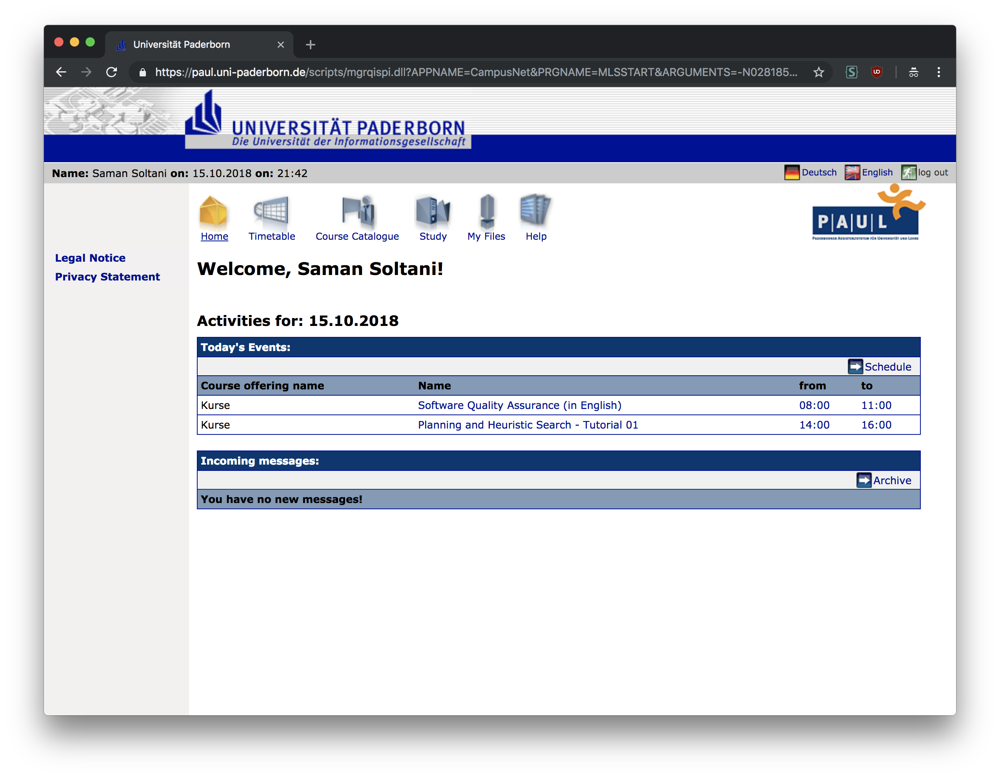
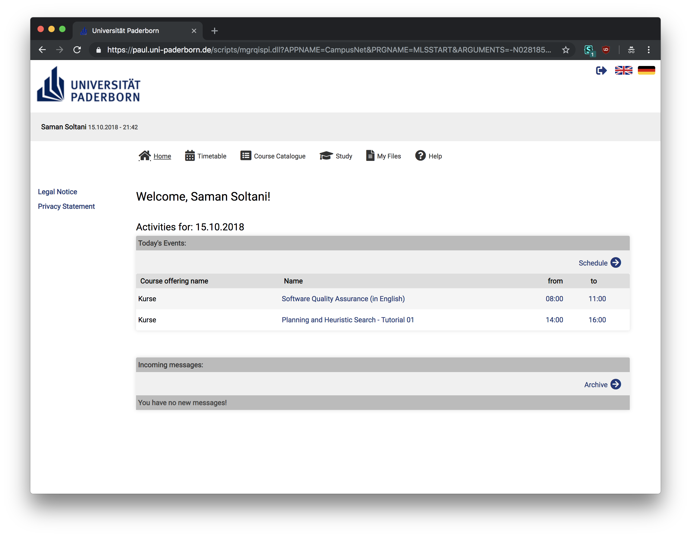

# PAUL new interface
custom interface of [PAUL system](https://paul.uni-paderborn.de) of [Paderborn University](https://uni-paderborn.de).

## Install
for using this style you have to inject the [style.css](./style.css) content to the Paul’s website.
To do so you need to install [Stylus](https://add0n.com/stylus.html) extension for your browser.

## Demo
|Before                       |After                     |
|:---------------------------:|:------------------------:|
| ||

## Contribution
If you have any suggestion feel free to create an issue or a pull request.